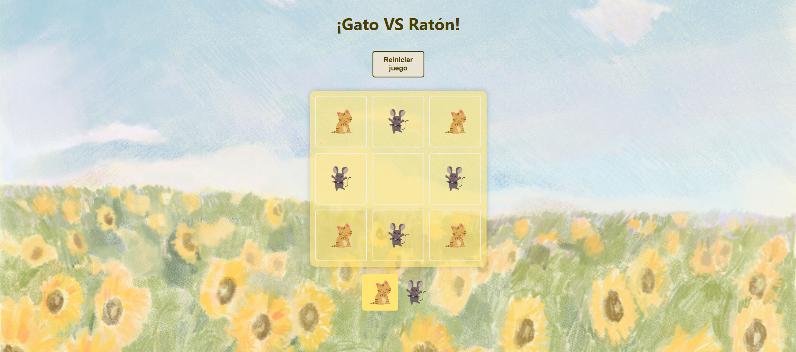

# Tic Tac Toe o Tres en Raya

  

## 👀 Vista Previa

Código hecho siguiendo el [Curso de React desde cero de MiduDev](https://github.com/midudev/aprendiendo-react/tree/master/projects/02-tic-tac-toe).
